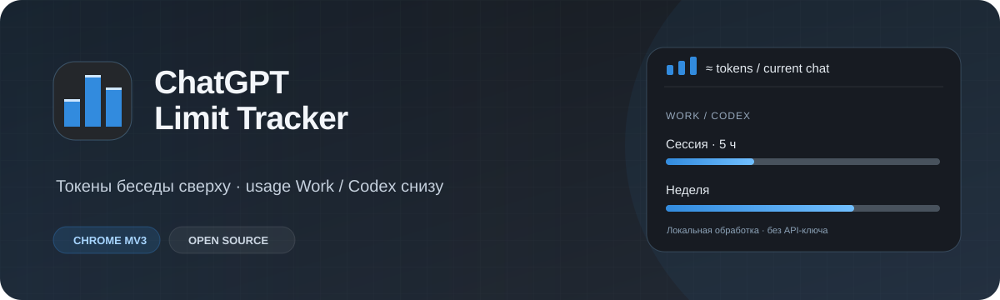
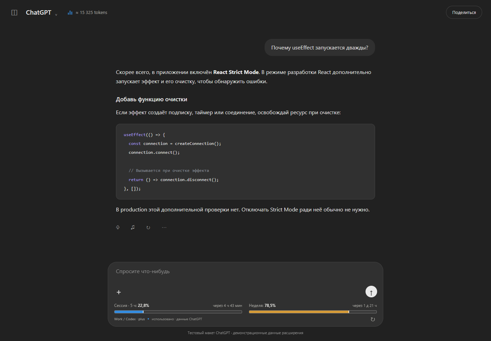
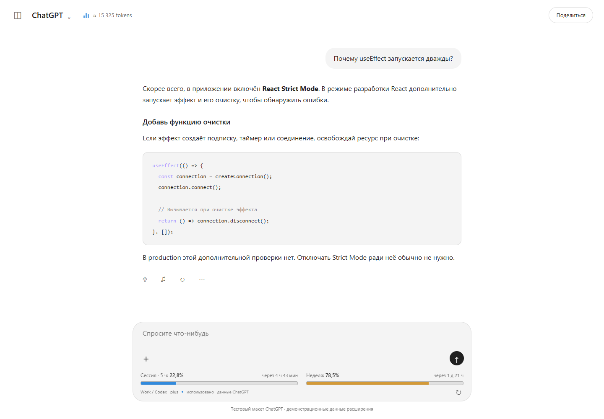
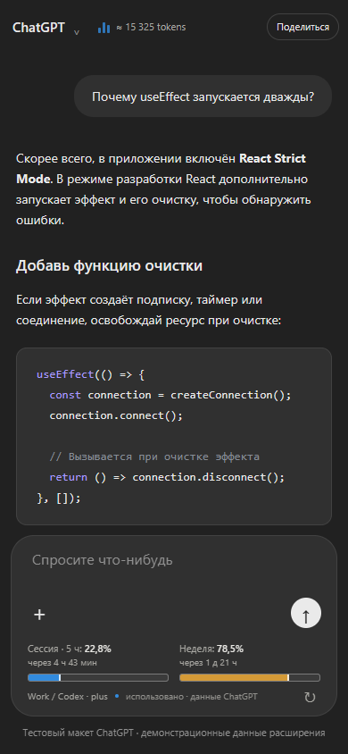

<div align="center">
  
  <h1>ChatGPT Limit Tracker</h1>
  <p>Токены беседы сверху. Использование Work / Codex под полем ввода.</p>
  
</div>

Расширение для **Google Chrome** (`Manifest V3`) добавляет в интерфейс [chatgpt.com](https://chatgpt.com/) счётчик токенов текущей ветки разговора и полосы серверного usage с временем сброса. Без API-ключа, аналитики и внешних серверов.

> **Важно:** полосы под чатом показывают общую квоту **ChatGPT Work / Codex**, а **не** лимит сообщений обычного Chat. Число токенов — оценка текста беседы, а не точное заполнение контекста модели.

## Как выглядит



<details>
<summary>Светлая тема и узкий экран</summary>

| Светлая тема | Узкий экран |
| --- | --- |
|  |  |

</details>

*Скриншоты сделаны на тестовой странице с демонстрационными ответами API. Они показывают интерфейс расширения, а не данные реального аккаунта.*

## Установка

1. Скачайте `chatgpt-limit-tracker-1.0.1.zip` из раздела **Releases** этого репозитория (после публикации релиза) или соберите проект по инструкции ниже.
2. Распакуйте ZIP в постоянную папку. Откройте в Chrome `chrome://extensions` и включите **Режим разработчика**.
3. Нажмите **Загрузить распакованное расширение** и выберите папку `chatgpt-limit-tracker`, в которой находится `manifest.json`.
4. Откройте или перезагрузите [chatgpt.com](https://chatgpt.com/).

Не выбирайте папку `extension/` из исходников: в ней ещё нет собранного токенизатора и иконок. После `npm run build` выбирайте `dist/chatgpt-limit-tracker/`.

## Возможности и ограничения

| Возможность | Как работает |
| --- | --- |
| Счётчик токенов | Считает текст текущей ветки разговора с помощью локального `gpt-tokenizer` (`o200k_base`). Обновляется во время генерации. |
| История беседы | Читает текущий разговор через внутренний API ChatGPT; если он недоступен, считает только загруженные на странице сообщения. |
| Две полосы usage | Показывают **использованный** процент окон общей квоты **Work / Codex** из `/backend-api/wham/usage`, если сервер передал эти данные. |
| Время сброса | Берётся из ответа сервера; обновление раз в минуту и вручную по кнопке `↻`. |
| Темы | Светлая и тёмная, в том числе на узком экране. |

Размер контекста **не определяется автоматически**: для конкретных тарифа, режима и продукта он может отличаться от заявленного для модели в API. Поэтому по умолчанию отображается только число токенов, **без шкалы заполнения**. Если вам точно известен размер контекста, в дополнительных настройках можно включить ориентировочную шкалу вручную. Не стоит ставить примерное число лишь ради полоски.

Счётчик не включает скрытые инструкции, reasoning, содержимое файлов и изображений, серверное сокращение истории и служебные токены. Токенизация модели тоже может отличаться. Таймера кэша, как в Claude Counter, нет: доступных надёжных данных для него ChatGPT не предоставляет.

Если сервер не передаёт usage, расширение показывает **«нет данных»**, а не придумывает проценты. При ошибке обновления ранее полученные значения помечаются устаревшими. Внутренний API и DOM ChatGPT могут измениться без предупреждения. Встроенное приложение ChatGPT расширения Chrome не поддерживает.

## Приватность

- Расширение работает только на `chatgpt.com`; единственное разрешение — `storage` для вашей настройки шкалы.
- История чатов, авторизационные токены и usage **не записываются** в хранилище расширения и не уходят на сторонние серверы.
- Запросы к внутреннему API выполняются от имени вашей текущей сессии только на `chatgpt.com`. Запрашивается текущий разговор, не весь список чатов.
- Нет аналитики, удалённого кода или требования вводить API-ключ.

## Разработка

Требуется Node.js 20+.

```sh
npm ci
npm run build
npm test
npx playwright install chromium
npm run test:browser
npm run package
```

Готовое расширение находится в `dist/chatgpt-limit-tracker/`, архив — в `chatgpt-limit-tracker-1.0.1.zip`. `npm run test:browser` запускает настоящее MV3-расширение в отдельном Chromium с тестовой страницей и контролируемыми ответами API — ваша переписка не используется. Для уже установленного Chromium можно указать путь через `CLT_CHROMIUM`.

## Подготовка публикации

Исходники и изображения `assets/` можно разместить на GitHub как обычный репозиторий. Архив для установки загрузите во вкладке **Releases → Draft a new release** как файл `chatgpt-limit-tracker-1.0.1.zip`, тег `v1.0.1`. GitHub автоматически покажет обложку и скриншоты в README. Для карточки репозитория **Settings → General → Social preview** можно загрузить `assets/social-preview.png`. Не загружайте `node_modules/`, `dist/` и `artifacts/` в историю репозитория; они исключены через `.gitignore`.

Для карточки репозитория: **About** → описание `Token counter for ChatGPT conversations and Work / Codex usage bars` и темы `chatgpt`, `chrome-extension`, `token-counter`, `usage-tracker`, `manifest-v3`.

## Лицензия

[MIT](LICENSE). Дизайн вдохновлён [Claude Counter](https://github.com/she-llac/claude-counter); реализация написана отдельно. Лицензия включённого `gpt-tokenizer` поставляется в `THIRD_PARTY_NOTICES.txt` внутри архива.
